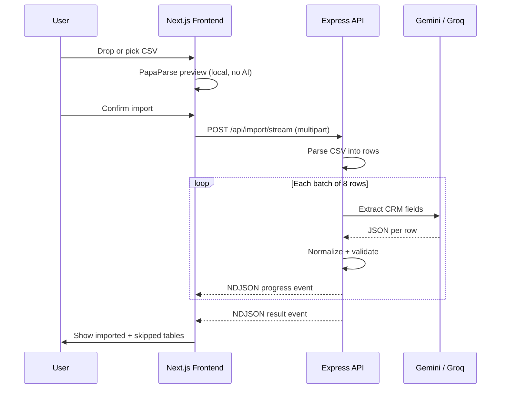

# GrowEasy AI CSV Importer

**Position applied for:** Software Developer Intern

An AI-powered CSV importer that intelligently maps arbitrary lead exports (Facebook Ads, Google Ads, Excel sheets, real-estate CRMs, agency reports, and manual spreadsheets) into the GrowEasy CRM schema. The core challenge is not CSV parsing — it is understanding heterogeneous column names and layouts, then extracting the correct CRM fields with AI.

---

## Project Specification

Build a CSV importer for the GrowEasy CRM that:

1. Lets the user upload any lead-export CSV (drag & drop or file picker).
2. Shows a **local preview first** — no AI processing happens until the user confirms the import.
3. On confirmation, uses AI to map arbitrary column names and layouts to the fixed CRM schema below.
4. Applies business rules: the first email/phone wins and extras go to notes, rows with no email **and** no mobile are skipped, dates must be JS-parseable, and enum fields must only use allowed values.
5. Displays imported and skipped rows with reasons after processing.

### CRM Fields

The AI extracts as many of these fields as possible from any CSV layout:

| Field | Description |
|---|---|
| `created_at` | Lead creation date |
| `name` | Lead name |
| `email` | Primary email |
| `country_code` | Country code |
| `mobile_without_country_code` | Mobile number |
| `company` | Company name |
| `city` | City |
| `state` | State |
| `country` | Country |
| `lead_owner` | Lead owner |
| `crm_status` | Lead status |
| `crm_note` | Notes / remarks |
| `data_source` | Source |
| `possession_time` | Property possession time |
| `description` | Additional description |

### Allowed values

**`crm_status`:** `GOOD_LEAD_FOLLOW_UP` · `DID_NOT_CONNECT` · `BAD_LEAD` · `SALE_DONE`

**`data_source`:** `leads_on_demand` · `meridian_tower` · `eden_park` · `varah_swamy` · `sarjapur_plots` (blank if none match confidently)

---

## What Was Implemented

- **Upload flow with preview-first UX** — drag & drop or file picker (`react-dropzone`), instant in-browser preview with PapaParse, and AI processing only after explicit confirmation.
- **AI extraction pipeline** — Google Gemini as the primary provider with structured JSON schema output, Groq as an automatic fallback, and a keyword-heuristic mapper as a last resort so the app works without API keys.
- **Streaming import endpoint** — `POST /api/import/stream` returns newline-delimited JSON progress events per batch, driving a real-time progress bar on the frontend.
- **Post-AI normalization layer** — deterministic code enforces enum validation, skip logic, date normalization, and extraction of extra emails/phones into `crm_note`.
- **GrowEasy CRM dashboard UI** — sidebar, lead-sources cards, manage-leads table with search, status badges, imported/skipped tabs, summary stats, and a virtualized results table.
- **Dark mode** — light/dark toggle with CSS variable theming and system-preference detection on first visit.
- **Tests** — Vitest suites for the CSV parser and normalizer (the deterministic layers), runnable with `corepack pnpm test`.
- **Deploy-ready monorepo** — pnpm workspaces with Docker Compose for local full-stack runs, plus Vercel (frontend) and Render/Railway (backend) configs.

### Stack

| Layer | Technology |
|---|---|
| Frontend | Next.js 16, React 19, Tailwind CSS 4 |
| Backend | Node.js, Express 5, TypeScript |
| AI | Google Gemini (`gemini-2.5-flash`), Groq (`llama-3.3-70b-versatile`) fallback |
| CSV | PapaParse (web), csv-parse (api) |
| UI utilities | react-dropzone, @tanstack/react-virtual |
| Validation & resilience | Zod, p-retry |
| Testing | Vitest |
| Tooling | pnpm workspaces, Docker Compose |

---

## Decisions and Why We Took Them

### Preview first, AI second

The assignment explicitly requires that no AI processing happens until the user confirms. Parsing with PapaParse in the browser gives instant feedback, keeps API costs down for abandoned uploads, and lets users verify they picked the right file before spending tokens. The backend re-parses authoritatively with `csv-parse`, keeping parsing logic independent of AI.

### AI provider: Gemini primary, Groq fallback, heuristic last resort

| Layer | Choice | Why |
|---|---|---|
| Primary | **Google Gemini** (`gemini-2.5-flash`) | Fast, cost-effective, native JSON schema output (`responseMimeType` + `responseJsonSchema`) |
| Fallback | **Groq** (`llama-3.3-70b-versatile`) | Automatic failover when Gemini rate-limits or errors |
| Last resort | **Keyword heuristic mapper** | Lets the app run locally without API keys for demos and development |

Structured JSON output from Gemini reduces parsing failures compared to free-form text responses. The heuristic layer mirrors common column naming patterns (`email`, `phone`, `status`, etc.) so the pipeline never fully breaks.

### Batch size of 8

Small batches balance:

- **Token limits** — wide CSVs with many columns stay within context windows
- **Latency** — users see progress after each batch instead of waiting for the entire file
- **Retry cost** — a failed batch retries only 8 rows, not the whole file

### NDJSON streaming instead of upload-then-poll

Instead of a single blocking JSON response, the API streams newline-delimited JSON events:

```json
{"type":"progress","processedBatches":1,"totalBatches":5,"message":"..."}
{"type":"result","summary":{...},"records":[...],"skipped":[...]}
```

Users get real-time progress during multi-batch AI extraction with fewer round trips and simpler client code. The frontend reads the stream with `ReadableStream` + `TextDecoder`, updating the progress bar without polling.

### Separating extraction (AI) from validation (code)

The LLM does semantic mapping; a dedicated `normalizer.ts` enforces hard business rules the model might miss:

- Enum validation for `crm_status` and `data_source`
- Skip logic (no email **and** no mobile)
- Date normalization to ISO strings
- Regex-based extraction of extra emails/phones from raw cells into `crm_note`
- Country-code inference from combined phone fields

This makes the system more predictable and testable — parser and normalizer tests never need to mock an LLM.

### AI prompt design

The system prompt (`openaiExtractor.ts`) encodes all assignment AI rules:

1. Allowed `crm_status` and `data_source` enums
2. First email/phone wins; extras go to `crm_note`
3. `created_at` must be JS-parseable
4. Single-line strings with escaped `\n`
5. No invented enum values

Gemini receives `responseJsonSchema` matching the `ExtractionPayload` type so the model cannot return arbitrary shapes. Each item includes a `confidence` field (`high` | `medium` | `low`) for future UI surfacing.

### Retry and resilience

```
extractBatch(batch)
  ├── try Gemini (p-retry: 2 attempts, 700–2000 ms backoff)
  ├── on failure → try Groq (same retry policy)
  └── on failure → heuristicKeywordMap per row
```

If no API keys are configured, heuristic mapping runs immediately so reviewers can test the full UI flow.

### Stateless architecture (no database)

Imports are ephemeral — results live in React state for the session:

- Matches the assignment's optional-database guidance
- Simplifies deployment (no Postgres/Redis to provision)
- Keeps the focus on CSV → CRM mapping, not persistence

### Backend layering

```
POST /api/import/stream
        │
        ▼
  routes/import.ts        ← HTTP, multer, NDJSON writer
        │
        ├── csvParser.ts  ← Buffer → CsvRecord[], chunking, malformed-row skip
        │
        ├── openaiExtractor.ts  ← Gemini / Groq / heuristic per batch
        │
        └── normalizer.ts ← Business rules, skip logic, enum coercion
```

| Layer | Responsibility |
|---|---|
| **Route** | Request validation, streaming response orchestration |
| **Parser** | Mechanical CSV → row objects (no AI) |
| **Extractor** | Semantic column → CRM field mapping |
| **Normalizer** | Deterministic validation and cleanup |

### Frontend component architecture

```
ImporterDashboard (orchestrator)
├── AppSidebar
├── LeadSourcesPage          ← entry point, "Import CSV" CTA
├── ManageLeadsPage          ← results, search, tabs, DataTable
└── ImportCsvModal           ← upload, preview, confirm, progress
```

`ImporterDashboard` owns all import state (file, preview, records, skipped, summary) and passes callbacks down. Child components stay presentational, keeping the upload → preview → confirm → results flow in one place.

### Monorepo layout (pnpm workspaces)

Shared TypeScript config, single `pnpm install`, parallel `pnpm dev`, and aligned CRM type definitions (`ParsedLead`, `crmStatuses`, `dataSources`) across apps without publishing a separate package.

### Virtualized results table (`@tanstack/react-virtual`)

Large imports can produce hundreds of rows. Virtualization renders only visible rows, keeping scroll performance smooth. The preview table uses a simpler capped scroll (250 rows) because it only needs a quick sanity check.

### Security and limits

- **5 MB upload cap** on both frontend (`react-dropzone`) and backend (`multer`) — matches typical lead-export sizes while keeping memory predictable with `multer.memoryStorage()`
- **API keys server-side only** — never exposed to the browser
- **No persistent storage** — uploaded CSVs are processed in memory and discarded

### Application flow



---

## Known Limitations

- **Preview table** is not virtualized; it shows up to 250 rows for quick review.
- **Results UI** displays the most important CRM columns (name, email, contact, date, company, status); all 15 fields are extracted and returned by the API.
- **AI confidence** is computed per row but not yet shown in the UI.
- **Import results** are session-only and lost on page refresh (by design — stateless).
- **Per-batch failure** aborts the entire import rather than skipping the failed batch and continuing.

---

This project was built as a technical assessment submission for GrowEasy.
