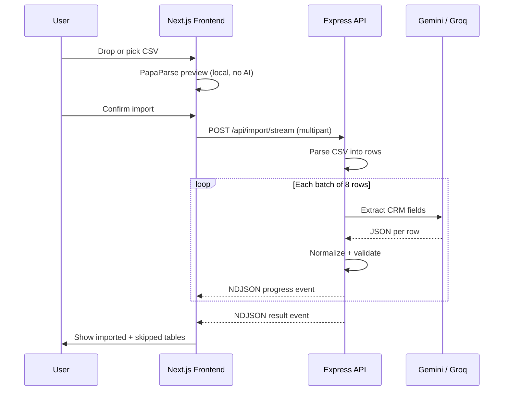

# GrowEasy AI CSV Importer

**Position applied for:** Intern

An AI-powered CSV importer that intelligently maps arbitrary lead exports (Facebook Ads, Google Ads, Excel sheets, real-estate CRMs, agency reports, and manual spreadsheets) into the GrowEasy CRM schema. The core challenge is not CSV parsing — it is understanding heterogeneous column names and layouts, then extracting the correct CRM fields with AI.

---

## Requirements Compliance

### Core functional requirements

| Requirement | Status | Notes |
|---|---|---|
| **Frontend — responsive web app** | ✅ Done | GrowEasy-style dashboard with sidebar, lead sources, and manage-leads views |
| **Step 1 — Upload CSV (drag & drop + file picker)** | ✅ Done | `react-dropzone` in the import modal |
| **Step 2 — Preview (no AI yet)** | ✅ Done | PapaParse runs entirely in the browser before any API call |
| **Preview table — horizontal scroll** | ✅ Done | `overflow-x-auto` with `min-w` constraints |
| **Preview table — vertical scroll** | ✅ Done | `max-h` + `overflow-auto` on preview container |
| **Preview table — sticky headers** | ✅ Done | `sticky top-0` on preview `<thead>` |
| **Step 3 — Confirm Import** | ✅ Done | Backend is called only after the user clicks **Upload File** |
| **Step 4 — Display parsed results** | ✅ Done | Imported and skipped tabs with summary stats |
| **Show imported / skipped / totals** | ✅ Done | Stat cards + tab counts on Manage Leads page |
| **Backend — accept any valid CSV** | ✅ Done | `multer` upload, no fixed column assumptions |
| **Backend — parse CSV into records** | ✅ Done | `csv-parse` with `columns: true` |
| **Backend — AI extraction in batches** | ✅ Done | Batches of 8 rows sent to Gemini |
| **Backend — return structured JSON** | ✅ Done | Final NDJSON `result` event with `records`, `skipped`, `summary` |
| **CRM field extraction (all 15 fields)** | ✅ Done | AI schema + post-processing normalizer |
| **AI rule — allowed `crm_status` values** | ✅ Done | Prompt + `statusMap` normalization |
| **AI rule — allowed `data_source` values** | ✅ Done | Prompt + enum validation; blank if unsure |
| **AI rule — `created_at` JS-parseable** | ✅ Done | `normalizeDate()` with ISO and day-first fallback |
| **AI rule — overflow into `crm_note`** | ✅ Done | Prompt + `mergeNotes()` |
| **AI rule — multiple emails/phones** | ✅ Done | First used; extras appended to `crm_note` |
| **AI rule — CSV row compatibility** | ✅ Done | Newlines escaped in string values |
| **AI rule — skip rows without email AND mobile** | ✅ Done | Enforced in `normalizer.ts` |

### Evaluation criteria coverage

| Criterion | Status | Notes |
|---|---|---|
| AI prompt engineering | ✅ Done | System prompt + JSON schema + heuristic fallback |
| Intelligent field mapping | ✅ Done | LLM maps arbitrary headers; keyword heuristic as fallback |
| Messy / ambiguous datasets | ✅ Done | Malformed row skip, enum normalization, note overflow |
| Backend API design | ✅ Done | Single streaming endpoint, clear event types |
| Clean architecture | ✅ Done | Route → parser → extractor → normalizer separation |
| Error handling | ✅ Done | 400s, mid-stream errors, network error messaging |
| Batch processing | ✅ Done | `chunkCandidates(rows, 8)` |
| Maintainable code | ✅ Done | Typed monorepo, shared CRM enums, Vitest tests |
| Modern responsive UI | ✅ Done | Tailwind CSS 4, modal flow, stat cards, badges |
| CSV preview UX | ✅ Done | Local parse, capped preview, required-headers hint |
| Loading states | ✅ Done | Parsing, uploading, progress bar, batch messages |
| Frontend error handling | ✅ Done | Parse errors, API errors, unreachable backend hint |
| Type safety | ✅ Done | TypeScript across frontend and backend |
| Folder structure | ✅ Done | pnpm workspace monorepo (`apps/api`, `apps/web`) |

### Bonus features

| Bonus | Status | Notes |
|---|---|---|
| Drag & drop upload | ✅ Done | |
| Progress indicators during AI | ✅ Done | NDJSON progress events + modal progress bar |
| Streaming / incremental parsing | ⚠️ Partial | AI batches stream via NDJSON; CSV itself is parsed in one pass |
| Retry for failed AI batches | ✅ Done | `p-retry` (2 retries, exponential backoff) + Groq fallback |
| Virtualized table for large CSVs | ⚠️ Partial | Results `DataTable` uses `@tanstack/react-virtual`; preview table is a plain scrollable table (capped at 250 rows) |
| Dark mode | ✅ Done | Toggle in sidebar (desktop) and top bar (mobile); respects system preference on first visit |
| Unit tests | ⚠️ Partial | 5 backend tests (parser + normalizer); no frontend or AI extractor tests |
| Docker setup | ✅ Done | Multi-stage `Dockerfile` + `docker-compose.yml` |
| Deployment config | ✅ Done | `vercel.json` (web) + `railway.json` (api) + instructions below |
| Well-written README | ✅ Done | This file |

### Final submission checklist

| Item | Status | Notes |
|---|---|---|
| Publicly hosted application | ⏳ Pending | Deploy to Vercel (web) + Railway (api) using instructions below |
| Public GitHub repository | ⏳ Pending | Initialize git and push to a public remote |
| README with setup instructions | ✅ Done | |
| Position applied for | ✅ Done | Intern |

**Summary:** All core assignment requirements are implemented, including dark mode. Submission hosting and GitHub publication are the remaining manual steps before final delivery.

---

## Why These Features Were Chosen

### Upload flow: preview first, AI second

The assignment explicitly requires that **no AI processing happens until the user confirms**. Parsing with PapaParse in the browser gives instant feedback, keeps API costs down for abandoned uploads, and lets users verify they picked the right file before spending tokens.

**Why PapaParse (frontend) + `csv-parse` (backend):** Both are mature, handle quoted fields and irregular delimiters well, and keep parsing logic independent of AI. The frontend parser is optimized for preview speed; the backend parser is authoritative for the import.

### Drag & drop + file picker (`react-dropzone`)

`react-dropzone` provides accessible drag-and-drop and a programmatic file-picker trigger in one hook. A 5 MB limit matches typical lead-export sizes while keeping memory usage predictable on the server (`multer.memoryStorage()`).

### AI provider: Gemini primary, Groq fallback, heuristic last resort

| Layer | Choice | Why |
|---|---|---|
| Primary | **Google Gemini** (`gemini-2.5-flash`) | Fast, cost-effective, native JSON schema output (`responseMimeType` + `responseJsonSchema`) |
| Fallback | **Groq** (`llama-3.3-70b-versatile`) | Automatic failover when Gemini rate-limits or errors |
| Last resort | **Keyword heuristic mapper** | Lets the app run locally without API keys for demos and development |

Structured JSON output from Gemini reduces parsing failures compared to free-form text responses. The heuristic layer mirrors common column naming patterns (`email`, `phone`, `status`, etc.) so the pipeline never fully breaks.

### Batch size of 8

Small batches balance:
- **Token limits** — wide CSVs with many columns stay within context windows
- **Latency** — users see progress after each batch instead of waiting for the entire file
- **Retry cost** — a failed batch retries only 8 rows, not the whole file

### NDJSON streaming (`POST /api/import/stream`)

Instead of a single blocking JSON response, the API streams newline-delimited JSON events:

```json
{"type":"progress","processedBatches":1,"totalBatches":5,"message":"..."}
{"type":"result","summary":{...},"records":[...],"skipped":[...]}
```

**Why:** Users get real-time progress during multi-batch AI extraction. The frontend reads the stream with `ReadableStream` + `TextDecoder`, updating the progress bar without polling.

### Post-AI normalization layer

The LLM does semantic mapping; a dedicated `normalizer.ts` enforces hard business rules the model might miss:
- Enum validation for `crm_status` and `data_source`
- Skip logic (no email **and** no mobile)
- Date normalization to ISO strings
- Regex-based extraction of extra emails/phones from raw cells into `crm_note`
- Country-code inference from combined phone fields

Separating **extraction** (AI) from **validation** (code) makes the system more predictable and testable.

### Stateless architecture (no database)

Imports are ephemeral — results live in React state for the session. **Why:**
- Matches the assignment's optional-database guidance
- Simplifies deployment (no Postgres/Redis to provision)
- Keeps the focus on CSV → CRM mapping, not persistence

### Virtualized results table (`@tanstack/react-virtual`)

Large imports can produce hundreds of rows. Virtualization renders only visible rows, keeping scroll performance smooth. The preview table uses a simpler capped scroll (250 rows) because it only needs a quick sanity check, not full-file navigation.

### GrowEasy CRM dashboard UI

The UI mirrors a real CRM (sidebar, lead sources cards, manage leads table) rather than a bare upload form. This demonstrates production-minded UX — search, status badges, imported/skipped tabs, and summary stats — while staying within the assignment scope.

### Docker + Vercel + Railway

| Target | Role |
|---|---|
| **Docker Compose** | One-command local full-stack run for reviewers |
| **Vercel** | Optimized Next.js hosting with edge-friendly static assets |
| **Railway** | Long-running Express process with env-based secrets for API keys |

The monorepo ships deploy configs for both platforms so frontend and backend can scale independently.

---

## Architectural Decisions

### Monorepo layout (pnpm workspaces)

```
GrowEasy Assesment/
├── apps/
│   ├── api/          # Express 5 backend
│   └── web/          # Next.js 16 frontend
├── Dockerfile        # Multi-stage: api + web targets
├── docker-compose.yml
├── vercel.json
├── apps/web/vercel.json
├── railway.json
├── pnpm-workspace.yaml
└── tsconfig.base.json
```

**Why a monorepo:** Shared TypeScript config, single `pnpm install`, parallel `pnpm dev`, and aligned CRM type definitions (`ParsedLead`, `crmStatuses`, `dataSources`) across apps without publishing a separate package.

### Backend layering

```
POST /api/import/stream
        │
        ▼
  routes/import.ts        ← HTTP, multer, NDJSON writer
        │
        ├── csvParser.ts  ← Buffer → CsvRecord[], chunking, malformed-row skip
        │
        ├── openaiExtractor.ts  ← Gemini / Groq / heuristic per batch
        │
        └── normalizer.ts ← Business rules, skip logic, enum coercion
```

| Layer | Responsibility |
|---|---|
| **Route** | Request validation, streaming response orchestration |
| **Parser** | Mechanical CSV → row objects (no AI) |
| **Extractor** | Semantic column → CRM field mapping |
| **Normalizer** | Deterministic validation and cleanup |

This separation means CSV parsing tests and normalization tests never need to mock an LLM.

### Frontend component architecture

```
ImporterDashboard (orchestrator)
├── AppSidebar
├── LeadSourcesPage          ← entry point, "Import CSV" CTA
├── ManageLeadsPage          ← results, search, tabs, DataTable
└── ImportCsvModal           ← upload, preview, confirm, progress
```

`ImporterDashboard` owns all import state (file, preview, records, skipped, summary) and passes callbacks down. Child components stay presentational. This keeps the upload → preview → confirm → results flow in one place.

### API contract

**Endpoint:** `POST /api/import/stream`  
**Content-Type:** `multipart/form-data` with field `file`  
**Response:** `application/x-ndjson`

| Event `type` | Payload |
|---|---|
| `progress` | `processedBatches`, `totalBatches`, `message`, `importedCount`, `skippedCount` |
| `result` | `summary`, `records[]`, `skipped[]` |
| `error` | `message` |

**Why one streaming endpoint instead of upload-then-poll:** Fewer round trips, simpler client code, and natural fit for batch-by-batch AI progress.

### AI prompt design

The system prompt (`openaiExtractor.ts`) encodes all assignment AI rules:
1. Allowed `crm_status` and `data_source` enums
2. First email/phone wins; extras go to `crm_note`
3. `created_at` must be JS-parseable
4. Single-line strings with escaped `\n`
5. No invented enum values

Gemini receives `responseJsonSchema` matching the `ExtractionPayload` type so the model cannot return arbitrary shapes. Each item includes a `confidence` field (`high` | `medium` | `low`) for future UI surfacing.

### Retry and resilience

```
extractBatch(batch)
  ├── try Gemini (p-retry: 2 attempts, 700–2000 ms backoff)
  ├── on failure → try Groq (same retry policy)
  └── on failure → heuristicKeywordMap per row
```

If no API keys are configured, heuristic mapping runs immediately so reviewers can test the full UI flow.

### CORS and local development

The API reads `WEB_ORIGIN` for CORS. Next.js rewrites `/api/*` → `http://localhost:4000` in development so the frontend can use relative URLs. In production, `NEXT_PUBLIC_API_BASE_URL` points to the Railway API domain.

### Security and limits

- **5 MB upload cap** on both frontend (`react-dropzone`) and backend (`multer`)
- **API keys server-side only** — never exposed to the browser
- **No persistent storage** — uploaded CSVs are processed in memory and discarded

### Testing strategy

| Test file | Covers |
|---|---|
| `csvParser.test.ts` | Parsing, trimming, malformed row skip, `chunkCandidates` |
| `normalizer.test.ts` | Multi email/phone → `crm_note`, skip logic, status normalization |

Tests target deterministic logic (parser + normalizer) rather than flaky LLM responses. Run with:

```bash
corepack pnpm test
```

---

## Stack

| Layer | Technology | Version |
|---|---|---|
| Frontend | Next.js, React, Tailwind CSS | 16, 19, 4 |
| Backend | Node.js, Express, TypeScript | —, 5, 5.x |
| AI | Google Gemini (primary), Groq (fallback) | gemini-2.5-flash, llama-3.3-70b-versatile |
| CSV | PapaParse (web), csv-parse (api) | — |
| Virtualization | @tanstack/react-virtual | — |
| Upload | react-dropzone | — |
| Validation | Zod | — |
| Retry | p-retry | — |
| Testing | Vitest | — |
| Monorepo | pnpm workspaces | 11.x |
| Containers | Docker, Docker Compose | — |

---

## CRM Fields

The AI extracts as many of these fields as possible from any CSV layout:

| Field | Description |
|---|---|
| `created_at` | Lead creation date |
| `name` | Lead name |
| `email` | Primary email |
| `country_code` | Country code |
| `mobile_without_country_code` | Mobile number |
| `company` | Company name |
| `city` | City |
| `state` | State |
| `country` | Country |
| `lead_owner` | Lead owner |
| `crm_status` | Lead status |
| `crm_note` | Notes / remarks |
| `data_source` | Source |
| `possession_time` | Property possession time |
| `description` | Additional description |

### Allowed values

**`crm_status`:** `GOOD_LEAD_FOLLOW_UP` · `DID_NOT_CONNECT` · `BAD_LEAD` · `SALE_DONE`

**`data_source`:** `leads_on_demand` · `meridian_tower` · `eden_park` · `varah_swamy` · `sarjapur_plots` (blank if none match confidently)

---

## Local Setup

### 1. Install dependencies

```bash
corepack enable
corepack pnpm install
```

### 2. Configure environment variables

```bash
cp .env.example .env
cp apps/api/.env.example apps/api/.env
cp apps/web/.env.example apps/web/.env.local
```

| Variable | Required | Description |
|---|---|---|
| `GEMINI_API_KEY` | Recommended | Primary AI provider |
| `GROQ_API_KEY` | Optional | Fallback when Gemini fails or rate-limits |
| `NEXT_PUBLIC_API_BASE_URL` | Yes | Backend URL, e.g. `http://localhost:4000` |
| `WEB_ORIGIN` | Yes | Frontend URL, e.g. `http://localhost:3000` |
| `GEMINI_MODEL` | Optional | Defaults to `gemini-2.5-flash` |
| `GROQ_MODEL` | Optional | Defaults to `llama-3.3-70b-versatile` |
| `PORT` | Optional | API port, defaults to `4000` |

If neither `GEMINI_API_KEY` nor `GROQ_API_KEY` is set, the backend uses heuristic keyword mapping so the app remains demoable without API keys.

### 3. Run the apps

```bash
corepack pnpm dev
```

| Service | URL |
|---|---|
| Frontend | http://localhost:3000 |
| Backend | http://localhost:4000 |
| Health check | http://localhost:4000/health |

---

## Scripts

```bash
corepack pnpm dev        # Run api + web in parallel
corepack pnpm build      # Production build both apps
corepack pnpm lint       # ESLint across workspace
corepack pnpm typecheck  # TypeScript check
corepack pnpm test       # Vitest (api tests)
corepack pnpm format     # Prettier
```

---

## API Reference

### `POST /api/import/stream`

Accepts a multipart form upload with a `file` field containing a CSV.

**Response:** newline-delimited JSON stream

**Progress event:**
```json
{
  "type": "progress",
  "message": "Processed batch 2 of 5.",
  "processedBatches": 2,
  "totalBatches": 5,
  "importedCount": 14,
  "skippedCount": 2
}
```

**Result event:**
```json
{
  "type": "result",
  "summary": {
    "totalRows": 50,
    "importedCount": 45,
    "skippedCount": 5,
    "processedBatches": 5,
    "totalBatches": 5
  },
  "records": [ /* ParsedLead[] */ ],
  "skipped": [ /* { rowNumber, reason, source }[] */ ]
}
```

### `GET /health`

Returns `{ "status": "ok" }` for uptime checks.

---

## Docker

Build and run both services:

```bash
docker compose up --build
```

The root `Dockerfile` contains separate `api` and `web` build targets used by `docker-compose.yml`.

---

## Deployment

Recommended setup:
- **Frontend:** Vercel (free)
- **Backend:** Render (free tier)

### 1. Push code to GitHub

Your backend and frontend deploy from the same GitHub repository.

```bash
git remote add origin https://github.com/<your-username>/<your-repo>.git
git push -u origin main
```

### 2. Deploy backend on Render (free tier)

#### Option A — Blueprint (easiest)

1. Go to [https://dashboard.render.com](https://dashboard.render.com) and sign in with GitHub
2. Click **New +** → **Blueprint**
3. Connect your GitHub repository
4. Render detects `render.yaml` and creates the `groweasy-api` web service
5. When prompted, enter secret values:
   - `GEMINI_API_KEY` — your Gemini API key
   - `WEB_ORIGIN` — your Vercel frontend URL (set this after step 3, then redeploy)
   - `GROQ_API_KEY` — optional fallback key
6. Click **Apply**

#### Option B — Manual web service

1. Go to [https://dashboard.render.com](https://dashboard.render.com)
2. **New +** → **Web Service**
3. Connect your GitHub repo
4. Use these settings:

| Setting | Value |
|---|---|
| **Name** | `groweasy-api` |
| **Region** | Closest to you |
| **Branch** | `main` |
| **Root Directory** | *(leave blank — repo root)* |
| **Runtime** | Node |
| **Build Command** | `corepack enable && corepack pnpm install --frozen-lockfile && corepack pnpm --filter api build` |
| **Start Command** | `corepack pnpm --filter api start` |
| **Plan** | Free |

5. Add **Environment Variables**:

| Variable | Value |
|---|---|
| `NODE_ENV` | `production` |
| `GEMINI_API_KEY` | Your Gemini API key |
| `GEMINI_MODEL` | `gemini-2.5-flash` |
| `GROQ_API_KEY` | *(optional)* |
| `GROQ_MODEL` | `llama-3.3-70b-versatile` |
| `WEB_ORIGIN` | `https://<your-vercel-app>.vercel.app` |

> **Do not set `PORT` manually.** Render injects `PORT` automatically and the API reads it.

6. Under **Advanced**, set **Health Check Path** to `/health`
7. Click **Create Web Service**

After deploy, copy your Render URL, e.g.:

`https://groweasy-api.onrender.com`

Test it:

```bash
curl https://groweasy-api.onrender.com/health
```

Expected response:

```json
{"status":"ok"}
```

#### Render free tier notes

- Services **spin down after ~15 minutes of inactivity**. The first request after idle can take **30–60 seconds** (cold start).
- For a demo/submission this is fine; mention it if reviewers test after a long pause.
- If imports time out on cold start, hit `/health` once in the browser, wait for `ok`, then retry the CSV import.

### 3. Deploy frontend on Vercel

You can deploy in **either** of these ways. If you already created a Vercel project, try **Option A** first (no Root Directory change needed).

#### Option A — Deploy from repo root (recommended if you see "No Next.js detected")

Leave **Root Directory** empty (repo root). The root `vercel.json` tells Vercel to build `apps/web`:

| Setting | Value |
|---|---|
| **Framework Preset** | `Next.js` (or `Other` — root `vercel.json` handles the build) |
| **Root Directory** | *(leave empty)* |
| **Install Command** | *(auto from root `vercel.json`)* |
| **Build Command** | *(auto from root `vercel.json`)* |

#### Option B — Deploy from `apps/web` subdirectory

| Setting | Value |
|---|---|
| **Framework Preset** | `Next.js` |
| **Root Directory** | `apps/web` |
| **Install Command** | `cd ../.. && corepack enable && corepack pnpm install --frozen-lockfile` |
| **Build Command** | `next build` |

Also enable **Settings → Build and Deployment → Include source files outside of the Root Directory**.

> If Root Directory is left at repo root **without** the root `vercel.json`, Vercel reads the root `package.json` (which has no `next` dependency path to your app) and fails with **"No Next.js version detected"**.

3. Add environment variables — pick **one** approach:

**Option A — Direct API URL (recommended with Render)**

| Variable | Value |
|---|---|
| `NEXT_PUBLIC_API_BASE_URL` | `https://groweasy-api.onrender.com` |

**Option B — Proxy through Vercel**

| Variable | Value |
|---|---|
| `NEXT_PUBLIC_API_BASE_URL` | *(leave empty)* |
| `API_PROXY_URL` | `https://groweasy-api.onrender.com` |

4. Deploy and copy your Vercel URL, e.g. `https://groweasy-csv-importer.vercel.app`

### 4. Connect frontend and backend

Go back to **Render → your service → Environment** and set:

```
WEB_ORIGIN=https://<your-vercel-app>.vercel.app
```

Click **Save Changes** (Render will redeploy automatically).

`WEB_ORIGIN` must match your Vercel URL exactly — no trailing slash.

### 5. Verify end-to-end

1. Open your Vercel URL
2. Upload a CSV and confirm the preview loads
3. Click **Upload File** and wait for AI processing
4. Check imported/skipped results on **Manage Leads**

If you see **"Could not reach the API"**:
- Confirm Render `/health` returns `{"status":"ok"}`
- Confirm `NEXT_PUBLIC_API_BASE_URL` points to your Render URL
- Confirm `WEB_ORIGIN` on Render matches your Vercel domain
- If the service was idle, wait for the cold start to finish and retry

### Alternative: Railway (backend)

Railway also works if you prefer it over Render. Use `railway.json` in the repo root and set the same environment variables (`GEMINI_API_KEY`, `WEB_ORIGIN`, etc.).

### Submission URLs

Add these to the top of this README after deploying:

```markdown
## Live Demo
- App: https://<your-vercel-app>.vercel.app
- API: https://<your-render-app>.onrender.com/health
- Repository: https://github.com/<your-username>/<your-repo>
```

---

## Key Files

| Concern | Path |
|---|---|
| Upload, preview, confirm UI | `apps/web/src/components/import-csv-modal.tsx` |
| Import orchestration + streaming client | `apps/web/src/components/importer-dashboard.tsx` |
| Local CSV preview (no AI) | `apps/web/src/lib/csv.ts` |
| Results display | `apps/web/src/components/manage-leads-page.tsx` |
| Virtualized table | `apps/web/src/components/data-table.tsx` |
| API route | `apps/api/src/routes/import.ts` |
| CSV parsing + chunking | `apps/api/src/services/csvParser.ts` |
| AI prompt + extraction + retry | `apps/api/src/services/openaiExtractor.ts` |
| Field normalization + business rules | `apps/api/src/services/normalizer.ts` |
| Shared CRM types | `apps/api/src/types.ts`, `apps/web/src/lib/types.ts` |
| Express app + CORS | `apps/api/src/index.ts` |

---

## Application Flow



---

## Known Limitations

- **Dark mode** is implemented with a light/dark toggle, CSS variable theming, and system-preference detection on first visit.
- **Preview table** is not virtualized; it shows up to 250 rows for quick review.
- **Results UI** displays the most important CRM columns (name, email, contact, date, company, status); all 15 fields are extracted and returned by the API.
- **AI confidence** is computed per row but not yet shown in the UI.
- **Import results** are session-only and lost on page refresh (by design — stateless).
- **Per-batch failure** aborts the entire import rather than skipping the failed batch and continuing.

---

## License

This project was built as a technical assessment submission for GrowEasy.
